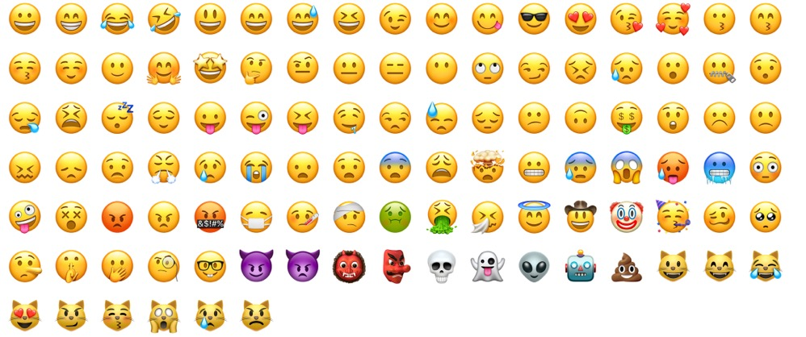
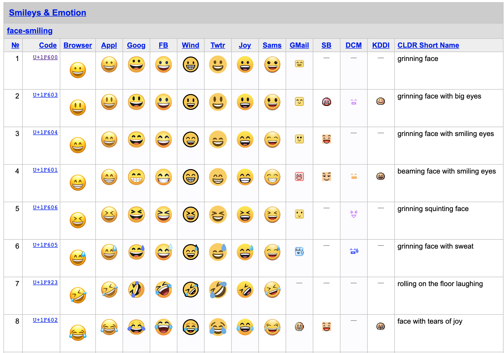

# CSS emoji字体

最近项目中需要用到表情，于是就调研了一下`CSS emoji`。

## 含义

`Emoji` 是可以插入文字的图形符号。



## 标准化

早期的 Emoji 是将一些特定的符号组合替换成图片，比如将:)替换成😀。这种方法很难标准化，能够表达的范围也有限。

2010年，Unicode 开始为 Emoji 分配码点。也就是说，现在的 Emoji 符号就是一个文字，它会被渲染为图形。



## 使用与实践

了解了基本概念之后，我们就要开始使用`emoji`来实现表情包。

> 目前主流的操作系统都已经内置emoji字体，例如苹果操作系统，iOS，安卓以及Windows 10等。

1. 直接复制粘贴使用。可以到这个网站([getemoji](https://getemoji.com/))，选中放到文档中即可。

等不及试一下，然后发现结果并没有我们想象的那么完美。


😀 😁 😂 🤣 😃 😄 😅 😆 😉 😊 😋 😎 😍 😘 🥰 😗 😙 😚 ☺️ 🙂 🤗 🤩 🤔 🤨 😐 😑 😶 🙄 😏 😣 😥 😮 🤐 😯 😪 😫 😴 😌 😛 😜 😝 🤤 😒 😓 😔 😕 🙃 🤑 😲 ☹️ 🙁 😖 😞 😟 😤 😢 😭 😦 😧 😨 😩 🤯 😬 😰 😱 🥵 🥶 😳 🤪 😵 😡 😠 🤬 😷 🤒 🤕 🤢 🤮 🤧 😇 🤠 🤡 🥳 🥴 🥺 🤥 🤫 🤭 🧐 🤓 😈 👿 👹 👺 💀 👻 👽 🤖 💩 😺 😸 😹 😻 😼 😽 🙀 😿 😾


然后发现某些表情没有颜色，例如：☹️。

为什么会这样呢？经过一番查阅表情☹️(`&#x2639`)在`Unicode`字符集中，包含了这个字符，所以不是彩色图形。

如果需要展示`emoji`表情，需要专门使用一下`emoji`字体：

```css
.text{
    font-family: Apple Color Emoji, Android Emoji, Segoe UI Emoji, Segoe UI Symbol, Noto Color Emoji;
}
```

- `Apple Color Emoji`用在Apple的产品中，例如iPhone（iOS系统）或者Mac Pro（macOS系统）等。
- `Android Emoji`用在Android的产品中，例如华为，小米手机等。
- `Segoe UI Emoji`用在Windows系统中。
- `Segoe UI Symbol`是在Windows 7中添加的一种新字体，它包括新的脚本/符号，如盲文、德塞莱特文、奥格姆文或符文字形。不过，它不是“符号字符集编码字体”（如MS symbol），而是一种Unicode编码字体，其符号被分配给各个Unicode码位。Segoe UI symbol还有一些其他杂项符号，如棋子，扑克牌和骰子符号（这些符号构成了Segoe国际象棋和Segoe新闻符号字体的基础）、制表符、块元素、技术符号、数学运算符、箭头、控制图片和OCR优化的符号。在Windows 8中，Segoe UI符号扩展到支持Glagolitic、Gothic，旧的斜体和Orkhon脚本。在Windows 8.1中，它获得了对Meroitic草书和科普特脚本的支持。从Windows 8更新的Segoe UI符号也已被移植到Windows 7。
- `Noto Color Emoji`是谷歌的Emoji字体，用在Android和Linux系统中。经过我的测试发现，Noto Color Emoji这个字体直接用在font-family属性中是没有用的，使用@font-face local("Noto Color Emoji")一下是有效的，有些奇怪。

修复完之后的样式如下：

<ClientOnly>
  <my-demo></my-demo>
</ClientOnly>

这样我们就可以愉快的使用`Emoji`表情了。

我们来看看github中的字体设置

```css
body{
    font-family: -apple-system,BlinkMacSystemFont,Segoe UI,Helvetica,Arial,sans-serif,Apple Color Emoji,Segoe UI Emoji;
}
```

看到Apple Color Emoji和Segoe UI Emoji这两个字体放在了最后。

☹️表情比较特殊，于是一些常规的字体就可以覆盖到，例如Arial。

有字符的Unicode比较靠后，这些字符设不设置都会表现为Emoji图形，例如这个笑脸😀。

在比如这个铅笔，于是下面这段CSS代码后面的“Apple Color Emoji,Segoe UI Emoji”就有作用了，可以让铅笔在视觉上是Emoji表情
```css
body{
    font-family: -apple-system,BlinkMacSystemFont,Segoe UI,Helvetica,Arial,sans-serif,Apple Color Emoji,Segoe UI Emoji;
}
```

如图：


但是，其他普通文字呈现的地方不要这么做，因为emoji字体也包含数字英文字母之类的，会影响正常内容的显示。同时，有时候我们希望有些字符还是原始形状，例如四个倾斜箭头字符↖ ↗ ↙ ↘，而不是Emoji效果。这个时候可以通过unicode-range限定下使用Emoji字符的范围，例如：

```css
@font-face {
  font-family: "my-emoji";
  src: local("Apple Color Emoji"),
       local("Android Emoji"),
       local("Segoe UI Emoji"), 
       local("Segoe UI Symbol"),
       local("Noto Color Emoji");
        /* Emoji unicode blocks */
       unicode-range: U+1F300-1F5FF, U+1F600-1F64F, U+1F680-1F6FF, U+2600-26FF;
}
.text {
    font-family: "my-emoji";
}
```

这里就简单介绍了一下`emoji`表情的使用。

## 参考文档

- [getemoji](https://getemoji.com/)
- [How to use web fonts in CSS](https://blog.logrocket.com/how-to-use-web-fonts-in-css-a0326f4d6a4d/)
- [css-tricks](https://css-tricks.com/snippets/css/system-font-stack/)
- [Google Noto Fonts](https://www.google.com/get/noto/)
- [关于CSS emoji字体](https://www.zhangxinxu.com/wordpress/2020/03/css-emoji-opentype-svg-fonts/)


