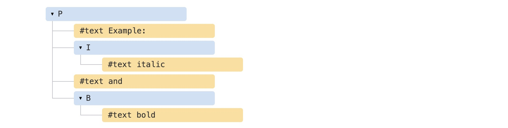
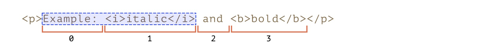
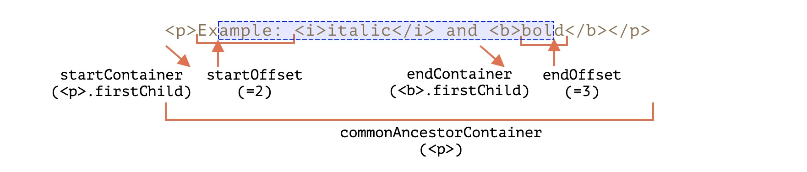
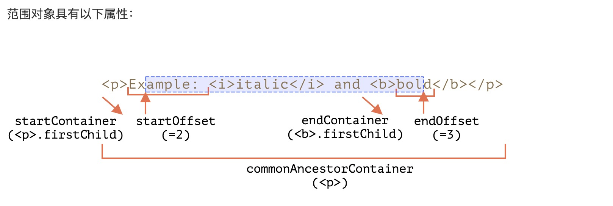

# Range对象

`Range` 接口表示一个包含节点与文本节点的一部分的文档片段。

可以用 `Document` 对象的 `Document.createRange` 方法创建 `Range`，也可以用 `Selection` 对象的 `getRangeAt` 方法获取 `Range`。另外，还可以通过 `Document` 对象的构造函数 `Range()` 来得到 `Range`。

## 属性

### commonAncestorContainer

- 返回完整包含 `startContainer` 和 `endContainer` 的、最深一级的节点。

### collapsed

- 返回一个表示 `Range` 的起始位置和终止位置是否相同的布尔值。

### startContainer

- 返回包含 `Range` 开始的节点。

### startOffset

- 返回一个表示 `Range` 起点在 `startContainer` 中的位置的数字（偏移量）。

### endContainer

- 返回包含 `Range` 结束的节点。

### endOffset

- 返回一个表示 `Range` 起点在 `endContainer` 中的位置的数字（偏移量）。

## 方法

> `node` 既可以是文本节点，也可以是元素节点：对于文本节点，`offset` 偏移的是字符数，而对于元素节点则是节点数。

### setStart(node, offset) 

- 设置起始于：node 中的位置 offset

### setStartBefore(node) 

- 设置起始于：node 之前

### setStartAfter(node) 

- 设置起始于：node 之后

### setEnd(node, offset) 

- 设置结束于：node 中的位置 offset

### setEndBefore(node) 

- 设置结束于：node 之前

### setEndAfter(node) 

- 设置结束于：node 之后

### selectNode(node) 

- 设置范围以选择整个 `node`及其内容
 
### selectNodeContents(node) 

- 设置范围以选择整个 `node` 的内容

### collapse(toStart) 

如果 `toStart=true` 则设置 `end=start`，否则设置 `start=end`，从而折叠范围

### cloneRange() 

创建一个具有相同起始/结束的新范围

### deleteContents() 

－ 从文档中删除范围内容

### extractContents()
 
－ 从文档中删除范围内容，并返回 `DocumentFragment`

### cloneContents() 

－ 复制范围内容，并返回 `DocumentFragment`

### insertNode(node) 

－ 在范围的起始处向文档中插入 `node`

### surroundContents(node) 

－ 以 `node` 包裹所选范围内容。要达到效果，则该范围内的所有元素都必须包含开始和结束标记：不能像 `<i>abc` 这样的部分范围。

## 范围

要了解选区（`Selection`）首先要了解范围，范围（`Range`）是选区的基本概念。范围本质上是一对“边界点”：范围起点和范围终点。

每个点都表示为一个父 `DOM` 节点，从起点偏移一段距离。如果父节点是元素节点，则偏移量是子节点个数，对于文本节点而言，则是文本中的位置。例如：

首先，我们可以创建一个范围：

```js
var range = new Range();
```

然后，我们可以使用`range.setStart(node, offset)`和`range.setEnd(node, offset)`来设置选区的边界。

考虑一下`HTML`片段：

```html
<p id="p">Example: <i>italic</i> and <b>bold</b></p>   
```

这是它的 `DOM` 结构，请注意，这里的文本节点对我们很重要：



我们来选择 `"Example: <i>italic</i>"`。那是`<p>`的头两个子节点（文本节点包括在内）：



```html
<p id="p">Example: <i>italic</i> and <b>bold</b></p>

<script>
  let range = new Range();

  range.setStart(p, 0);
  range.setEnd(p, 2);

  // 范围的 toString 以文本形式返回其内容（不带标签）
  alert(range); // Example: italic

  // 将此范围应用于文档选区（稍后解释）
  document.getSelection().addRange(range);
</script>
```

- `range.setStart(p, 0)` － 将起始位置设为 `<p>` 的第 0 个子节点（即文本节点 "Example: "）。
- `range.setEnd(p, 2)` － 覆盖范围至（但不包括）`<p>` 的第 2 个子节点（即文本节点 " and "，但由于不包括末节点，最后选择的节点是 `<i>`）。

我们不必在 `setStart` 和 `setEnd` 中使用相同的节点。一个范围可能跨越许多不相关的节点。唯一要注意的是终点要在起点之后。

## Range属性

让我们部分地选择文本，如下所示：



这也是可以做到的，我们只需要将起点和终点设置为文本节点中的相对偏移量即可。

我们需要创建一个范围，即：

- 从 `<p>` 的第一个子节点的位置 2 开始（选择 "Example: " 中除头两个字符外的所有字符)
- 到 `<b>` 的第一个子节点的位置 3 结束（选择 “bold” 的头三个字符，就这些）

```html
<p id="p">Example: <i>italic</i> and <b>bold</b></p>

<script>
  let range = new Range();

  range.setStart(p.firstChild, 2);
  range.setEnd(p.querySelector('b').firstChild, 3);

  alert(range); // ample: italic and bol

  // 在选区中使用此范围（后文有解释）
  window.getSelection().addRange(range);
</script>
```



- `startContainer`、`startOffset` 分别是 `<p>` 中的第一个文本节点和 2。

- `endContainer`、`endOffset` 分别是 `<b>` 中的第一个文本节点和 3。

- `collapsed` 在上例中：`false`。

- `commonAncestorContainer` － 在上例中：`<p>`。

## Range方法

使用`Range`方法，我们基本上可以对选定的节点执行任何操作。

例如下面的示例代码：

```html
<p id="p">Example: <i>italic</i> and <b>bold</b></p>

<p id="result"></p>
<script>
  let range = new Range();

  // 下面演示上述的各个方法：
  let methods = {
    deleteContents() {
      range.deleteContents()
    },
    extractContents() {
      let content = range.extractContents();
      result.innerHTML = "";
      result.append("extracted: ", content);
    },
    cloneContents() {
      let content = range.cloneContents();
      result.innerHTML = "";
      result.append("cloned: ", content);
    },
    insertNode() {
      let newNode = document.createElement('u');
      newNode.innerHTML = "NEW NODE";
      range.insertNode(newNode);
    },
    surroundContents() {
      let newNode = document.createElement('u');
      try {
        range.surroundContents(newNode);
      } catch(e) { alert(e) }
    },
    resetExample() {
      p.innerHTML = `Example: <i>italic</i> and <b>bold</b>`;
      result.innerHTML = "";

      range.setStart(p, 1);
      range.setEnd(p, 2);

      window.getSelection().removeAllRanges();
      window.getSelection().addRange(range);
    }
  };

  for(let method in methods) {
    document.write(`<div><button onclick="methods.${method}()">${method}</button></div>`);
  }

  methods.resetExample();
</script>
```

这里有[demo示例](https://yaesakuras.github.io/react-ts/#/range)提供演示参考。

还有一些其他API但是很少使用。如您需要，请参考 [规范](https://dom.spec.whatwg.org/#interface-range) 或 [MDN](https://developer.mozilla.org/zh-CN/docs/Web/API/Range) 手册。


