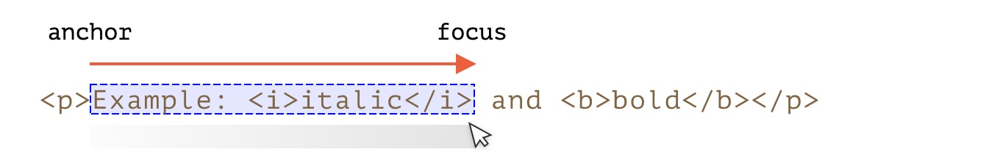
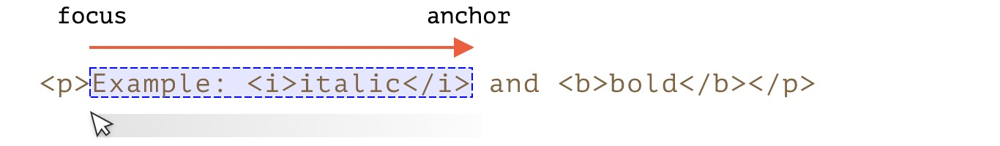

# Selection对象

`Selection`对象表示用户选择的文本范围或插入符号的当前位置。它代表页面中的文本选区，可能横跨多个元素。文本选区由用户拖拽鼠标经过文字而产生。

文档的选区是由 `Selection` 对象表示的，可通过 `window.getSelection()` 或 `document.getSelection()` 来获取。

## 属性

### anchorNode

返回该选区起点所在的节点。
   
### anchorOffset

返回一个数字，其表示的是选区起点在 anchorNode 中的位置偏移量。
1. 如果 anchorNode 是文字节点，那么返回的就是从该文字节点的第一个字开始，直到被选中的第一个字之间的字数（如果第一个字就被选中，那么偏移量为零）。
2. 如果 anchorNode 是一个元素，那么返回的就是在选区第一个节点之前的同级节点总数。(这些节点都是 anchorNode 的子节点)
    
### focusNode

返回该选区终点所在的节点。
    
### focusOffset

返回一个数字，其表示的是选区终点在 focusOffset 中的位置偏移量。
1. 如果 focusNode 是文字节点，那么选区末尾未被选中的第一个字，在该文字节点中是第几个字（从0开始计），就返回它。
2. 如果 focusNode 是一个元素，那么返回的就是在选区末尾之后第一个节点之前的同级节点总数。
    
### isCollapsed

返回一个布尔值，用于判断选区的起始点和终点是否在同一个位置。如果未选择任何内容（空范围）或不存在，则为 true 。
    
### rangeCount
    
选区中的范围数，除 Firefox 外，其他浏览器最多为 1。
    
### type

返回该选区节点类型。

::: tip 在文档中，选区的终点可能在起点之前

有很多选择内容的方法，视用户操作而定：鼠标、热键、手机上点击等。

其中的某些方法，例如鼠标，可以在两个方向上创建相同的选区：“从左至右”和“从右至左”。

如果在文档中选区的起点（锚点）在终点（焦点）之前，则称此选区具有“向前（forward）”方向。

例如，如果用户开始使用鼠标从 “Example” 选择到 “italic”：



否则，如果是从 “italic” 的末尾选择到 “Example”，则该选区方向是“向后（backward）”，其焦点是在锚点之前：



这与始终向前的 `Range` 对象不同：范围的起点不能在终点之后。
:::
    

## 方法

### getRangeAt(i) 

获取从 0 开始的第 i 个范围。在除 Firefox 之外的所有浏览器中，仅使用 0。

### addRange(range)

`addRange(range)` 将 `range` 添加到选区中。如果选区已有关联的范围，则除 Firefox 外的所有浏览器都将忽略该调用。

### removeRange(range)

从选区中删除 `range`。

### removeAllRanges()

删除所有选区。

### empty()

等价于 removeAllRanges （IE9以下使用）

### collapse(node, offset)

用一个新的范围替换选定的范围，该新范围从给定的 node 处开始，到偏移 offset 处结束。

### setPosition(node, offset)

等价于 collapse

### collapseToStart()

将当前的选区折叠到起始点。

### collapseToEnd()

折叠到选区终点。 

### extend(node, offset)

将选区的焦点移到给定的 node，位置偏移 offset。

### setBaseAndExtent(anchorNode, anchorOffset, focusNode, focusOffset) 

用给定的起点 anchorNode/anchorOffset 和 终点 focusNode/focusOffset 来替换选区范围。选中它们之间的所有内容。

### selectAllChildren(node)

 选择 node 的所有子节点。

### deleteFromDocument()

从文档中删除所选内容。

### containsNode(node, allowPartialContainment = false)

检查选区中是否包含 node（特别是如果第二个参数是 true 的话）

### modify(alter, direction, granularity)

通过简单的文本命令来改变当前选区或光标位置。

### toString()

返回当前选区的纯文本内容。 

## 事件

### onselectstart

当在 `dom` 上开始选择时，例如，用户按下鼠标键并开始移动鼠标。

### onselectionchange

当选区变动时 -请注意：此处理程序只能在 document 上设置。


## 选区方法及事件实例

### 选区跟踪示例

下面是一小段代码，演示如何随选区的改变来动态显示其边界：

```html
<p id="p">Select me: <i>italic</i> and <b>bold</b></p>

From <input id="from" disabled> – To <input id="to" disabled>
<script>
  document.onselectionchange = function() {
    let {anchorNode, anchorOffset, focusNode, focusOffset} = document.getSelection();

    from.value = `${anchorNode && anchorNode.data}:${anchorOffset}`;
    to.value = `${focusNode && focusNode.data}:${focusOffset}`;
  };
</script>
```

### 选区获取示例

如要获取整个选区：

- 作为文本：只需调用 `document.getSelection().toString()`。
- 作为 `DOM` 节点：获取底层的范围并调用其 `cloneContents()` 方法（如果我们不支持 Firefox 多选区的话，则仅取第一个范围）。

下面是将选区选作为文本和 `DOM` 节点的示例代码：

```html
<p id="p">Select me: <i>italic</i> and <b>bold</b></p>

Cloned: <span id="cloned"></span>
<br>
As text: <span id="astext"></span>

<script>
  document.onselectionchange = function() {
    let selection = document.getSelection();

    cloned.innerHTML = astext.innerHTML = "";

    // 从范围复制 DOM 节点（这里我们支持多选）
    for (let i = 0; i < selection.rangeCount; i++) {
      cloned.append(selection.getRangeAt(i).cloneContents());
    }

    // 以文本形式获取
    astext.innerHTML += selection;
  };
</script>
```

### 选区选择实例

对于许多任务，我们可以调用 `Selection` 方法，而无需访问底层的 `Range` 对象。

例如，选择段落 `<p>` 的全部内容：

```html
<p id="p">Select me: <i>italic</i> and <b>bold</b></p>

<script>
  // 从 <p> 的第 0 个子节点中选择到最后一个子节点
  document.getSelection().setBaseAndExtent(p, 0, p, p.childNodes.length);
</script>
```

同样用范围来做：

```html
<p id="p">Select me: <i>italic</i> and <b>bold</b></p>

<script>
  let range = new Range();
  range.selectNodeContents(p); // 或用 selectNode(p) 也选择 <p> 标记

  document.getSelection().removeAllRanges(); // 清除现有选区（如果有的话）
  document.getSelection().addRange(range);
</script>
```

::: tip 如要选择，先删除现有的选区

如果选区已存在，则先用 `removeAllRanges()` 删除之。然后添加范围。否则，除 Firefox 外的所有浏览器都将忽略新范围。

某些选区方法是一个例外，它们会替换现有的选区，例如 `setBaseAndExtent`。
:::

## 表单控件中的选区

表单元素如 `input` 和 `textarea` 提供 选区专用 API，没有 `Selection` 或 `Range` 对象。由于输入值是纯文本而不是 `HTML`，因此不需要此类对象，一切都变得更加简单。

属性：

- `input.selectionStart` － 选区的起始位置（可写）。
- `input.selectionEnd` － 选区的结束位置（可写）。
- `input.selectionDirection` － 选区方向，可以是：“forward”, “backward” 或 “none”（如通过双击选区）。

事件：

- `input.onselect` － 选择某项时触发。

方法：

- `input.select()` － 选择文本控件中的所有内容（可以是 `textarea` 而不是 `input`），
- `input.setSelectionRange(start, end, [direction])` － 在给定方向上（可选），从 `start` 一直选择到 `end`。
- `input.setRangeText(replacement, [start], [end], [selectionMode])` － 用新文本替换文本范围。
可选参数 `start` 和 `end`，如果提供的话，则设置范围的起点和终点，否则使用用户选区。

    最后一个参数 `selectionMode` 决定替换文本后如何设置选区。可能的值为：
    
        1. "select" － 将选择新插入的文本。
        2. "start" － 选区范围在插入的文本之前折叠（光标将在其之前）。
        3. "end" － 选区范围在插入的文本之后折叠（光标将在其后）。
        4. "preserve" － 尝试保留选区。这是默认值。


### 跟踪选区示例

例如，此段代码使用 `onselect` 事件来跟踪选区：

```html
<textarea id="area" style="width:80%;height:60px">
Selecting in this text updates values below.
</textarea>
<br>
From <input id="from" disabled> – To <input id="to" disabled>

<script>
  area.onselect = function() {
    from.value = area.selectionStart;
    to.value = area.selectionEnd;
  };
</script>
```

::: tip 注意

`onselect` 是在选定某项时触发，而不是在删除选定项时触发。

`document.onselectionchange` 事件不应触发表单控件内的选区，因为它与 `document` 选区和范围不相关。一些浏览器会生成它，但我们不应该依赖它。
:::

### 移动光标示例

我们可以更改 `selectionStart` 和 `selectionEnd`，二者设定了选区。

一个重要的边界情况是 `selectionStart` 和 `selectionEnd` 彼此相等。那就正是光标位置。或者，换句话说，当未选择任何内容时，选区会在光标位置折叠。

因此，通过设置 `selectionStart` 和 `selectionEnd` 为相同的值，我们可以移动光标。

例如：

```html
<textarea id="area" style="width:80%;height:60px">
Focus on me, the cursor will be at position 10.
</textarea>

<script>
  area.onfocus = () => {
    // 将 setTimeout 设为零延迟，以便在浏览器“焦点”操作完成后运行
    setTimeout(() => {
      // 我们可以设置任何选区
      // 如果 start=end，则将光标精确定位在该位置
      area.selectionStart = area.selectionEnd = 10;
    });
  };
</script>
```

### 修改选区示例

如要修改选区的内容，我们可以使用 `input.setRangeText()` 方法。当然，我们可以读取 `selectionStart/End`，并在了解选区的情况下更改 `value` 的相应子字符串，但是 `setRangeText` 功能更强大，通常更方便。

那是一个有点复杂的方法。使用其最简单的单参数形式，它可以替换用户选择的范围并删除该选区。

例如，在这里，用户选区将由 `*...*` 包裹：

```html
<input id="input" style="width:200px" value="Select here and click the button">
<button id="button">Wrap selection in stars *...*</button>

<script>
button.onclick = () => {
  if (input.selectionStart === input.selectionEnd) {
    return; // 什么都没选
  }

  let selected = input.value.slice(input.selectionStart, input.selectionEnd);
  input.setRangeText(`*${selected}*`);
};
</script>
```

利用更多参数，我们可以设置范围 `start` 和 `end`。

在本示例中，我们在输入文本中找到 `"THIS"`，替换它并保持被选中的状态：

```html
<input id="input" style="width:200px" value="Replace THIS in text">
<button id="button">Replace THIS</button>

<script>
button.onclick = () => {
  let pos = input.value.indexOf("THIS");
  if (pos >= 0) {
    input.setRangeText("*THIS*", pos, pos + 4, "select");
    input.focus(); // 选中它，使选区可见
  }
};
</script>
```

### 在光标处插入示例

如果未选择任何内容，或者在 `setRangeText` 中使用相同的 `start` 和 `end`，则仅插入新文本，不会删除任何内容。

我们也可以使用 `setRangeText` 在“光标处”插入一些东西。

这是一个按钮，按下后会在光标位置插入 `"HELLO"`，然后光标紧随其后。如果选区不为空，则将其替换（我们可以通过比较`selectionStart!=selectionEnd` 来进行检测，否则如为空则做点别的事）：

```html
<input id="input" style="width:200px" value="Text Text Text Text Text">
<button id="button">Insert "HELLO" at cursor</button>

<script>
  button.onclick = () => {
    input.setRangeText("HELLO", input.selectionStart, input.selectionEnd, "end");
    input.focus();
  };
</script>
```

### 使不可选

要使某些内容不可选，有三种方式：

1. 使用 `CSS` 属性 `user-select: none`。

```html
<style>
#elem {
  user-select: none;
}
</style>
<div>Selectable <div id="elem">Unselectable</div> Selectable</div>
```

这样不允许选区从 `elem` 开始。但是用户可以在其他地方开始选择，并将 `elem` 包含在内。

然后 `elem` 便成为 `document.getSelection()` 的一部分，因此选区是有了，但其内容通常在复制粘贴中被忽略。

2. 防止在 `onselectstart` 或 `mousedown` 事件中执行默认操作。

```html
<div>Selectable <div id="elem">Unselectable</div> Selectable</div>

<script>
elem.onselectstart = () => false;
</script>
```

这样可以防止在 `elem` 上开始选择，但是访问者可以在另一个元素上开始选择，然后扩展到 `elem`。

当同一操作上有另一个事件处理程序该触发选区时（例如 `mousedown`），这便会很方便。因此我们禁用选区以避免冲突，仍然允许复制 `elem` 内容。

3. 我们也可以使用 `document.getSelection().empty()` 来清除选区。这很少使用，因为会在选区选中和消失时导致不必要的闪烁。

以上代码示例可以点击[查看](https://yaesakuras.github.io/react-ts/#/selection)

如您需要更多需求，请参考 [规范](https://www.w3.org/TR/selection-api/) 或 [MDN](https://developer.mozilla.org/zh-CN/docs/Web/API/Selection) 手册。


