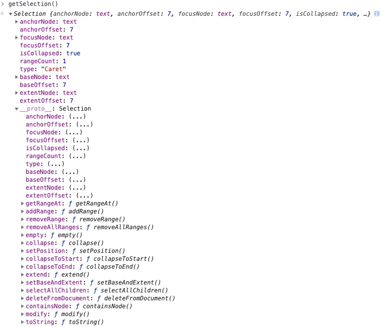

# Selection对象

`Selection`对象表示用户选择的文本范围或插入符号的当前位置。它代表页面中的文本选区，可能横跨多个元素。文本选区由用户拖拽鼠标经过文字而产生。要获取用于检查或修改的`Selection`对象，请调用 `window.getSelection()`。

创建一个`selection`对象非常简单，代码如下：

```js
const selection = window.getSelection();
console.log(selection);
```

在控制台查看一下结果，`selection`对象中的属性及方法如下图：



## 属性

### anchorNode

返回该选区起点所在的节点。
   
### anchorOffset

返回一个数字，其表示的是选区起点在 anchorNode 中的位置偏移量。
1. 如果 anchorNode 是文字节点，那么返回的就是从该文字节点的第一个字开始，直到被选中的第一个字之间的字数（如果第一个字就被选中，那么偏移量为零）。
2. 如果 anchorNode 是一个元素，那么返回的就是在选区第一个节点之前的同级节点总数。(这些节点都是 anchorNode 的子节点)
    
### focusNode

返回该选区终点所在的节点。
    
### focusOffset

返回一个数字，其表示的是选区终点在 focusOffset 中的位置偏移量。
1. 如果 focusNode 是文字节点，那么选区末尾未被选中的第一个字，在该文字节点中是第几个字（从0开始计），就返回它。
2. 如果 focusNode 是一个元素，那么返回的就是在选区末尾之后第一个节点之前的同级节点总数。
    
### isCollapsed

返回一个布尔值，用于判断选区的起始点和终点是否在同一个位置。
    
### rangeCount
    
返回该选区所包含的连续范围的数量。
    
### type

返回该选区节点类型。

### baseNode

等价于 anchorNode
    
### baseOffset

等价于 anchorOffset
    
### extentNode
    
等价于 focusNode
    

## 方法

### getRangeAt

`getRangeAt(i)`  返回选区开始的节点。

### addRange

`addRange(range)` 一个区域（Range）对象将被加入选区。

### removeRange

`removeRange(range)` 从选区中移除一个区域。

### removeAllRanges

`removeAllRanges()` 从选区中移除一个区域。

### empty

`empty()` 等价于 removeAllRanges （IE9以下使用）

### collapse

`collapse(node, offset)` 将当前的选区折叠为一个点。

### setPosition

`setPosition(node, offset)` 等价于 collapse

### collapseToStart

`collapseToStart()` 将当前的选区折叠到起始点。

### collapseToEnd

`collapseToEnd()` 将当前的选区折叠到最末尾的一个点。 

### extend

`extend(node, offset)` 将选区的焦点移动到一个特定的位置。

### setBaseAndExtent

`setBaseAndExtent(anchorNode, anchorOffset, focusNode, focusOffset)`

### selectAllChildren

`selectAllChildren(node)` 将某一指定节点的子节点框入选区。

### deleteFromDocument

`deleteFromDocument()` 从页面中删除选区中的内容。

### containsNode

`containsNode(node,partlyContained)` 判断某一个node是否为当前选区的一部分。

### modify

`modify()` 修改当前的选区。

### toString

`toString()` 返回当前选区的纯文本内容。 