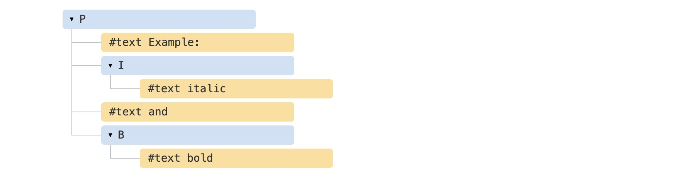
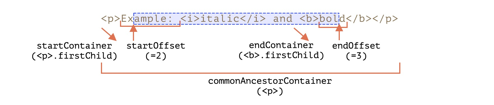

# Selection对象

`Selection`对象表示用户选择的文本范围或插入符号的当前位置。它代表页面中的文本选区，可能横跨多个元素。文本选区由用户拖拽鼠标经过文字而产生。要获取用于检查或修改的`Selection`对象，请调用 `window.getSelection()`。

创建一个`selection`对象非常简单，代码如下：

```js
const selection = window.getSelection();
console.log(selection);
```

在控制台查看一下结果，`selection`对象中的属性及方法如下图：


## 属性

### anchorNode

返回该选区起点所在的节点。
   
### anchorOffset

返回一个数字，其表示的是选区起点在 anchorNode 中的位置偏移量。
1. 如果 anchorNode 是文字节点，那么返回的就是从该文字节点的第一个字开始，直到被选中的第一个字之间的字数（如果第一个字就被选中，那么偏移量为零）。
2. 如果 anchorNode 是一个元素，那么返回的就是在选区第一个节点之前的同级节点总数。(这些节点都是 anchorNode 的子节点)
    
### focusNode

返回该选区终点所在的节点。
    
### focusOffset

返回一个数字，其表示的是选区终点在 focusOffset 中的位置偏移量。
1. 如果 focusNode 是文字节点，那么选区末尾未被选中的第一个字，在该文字节点中是第几个字（从0开始计），就返回它。
2. 如果 focusNode 是一个元素，那么返回的就是在选区末尾之后第一个节点之前的同级节点总数。
    
### isCollapsed

返回一个布尔值，用于判断选区的起始点和终点是否在同一个位置。
    
### rangeCount
    
返回该选区所包含的连续范围的数量。
    
### type

返回该选区节点类型。

### baseNode

等价于 anchorNode
    
### baseOffset

等价于 anchorOffset
    
### extentNode
    
等价于 focusNode
    

## 方法

### getRangeAt

`getRangeAt(i)`  返回选区开始的节点。

### addRange

`addRange(range)` 一个区域（Range）对象将被加入选区。

### removeRange

`removeRange(range)` 从选区中移除一个区域。

### removeAllRanges

`removeAllRanges()` 从选区中移除一个区域。

### empty

`empty()` 等价于 removeAllRanges （IE9以下使用）

### collapse

`collapse(node, offset)` 将当前的选区折叠为一个点。

### setPosition

`setPosition(node, offset)` 等价于 collapse

### collapseToStart

`collapseToStart()` 将当前的选区折叠到起始点。

### collapseToEnd

`collapseToEnd()` 将当前的选区折叠到最末尾的一个点。 

### extend

`extend(node, offset)` 将选区的焦点移动到一个特定的位置。

### setBaseAndExtent

`setBaseAndExtent(anchorNode, anchorOffset, focusNode, focusOffset)`

### selectAllChildren

`selectAllChildren(node)` 将某一指定节点的子节点框入选区。

### deleteFromDocument

`deleteFromDocument()` 从页面中删除选区中的内容。

### containsNode

`containsNode(node,partlyContained)` 判断某一个node是否为当前选区的一部分。

### modify

`modify()` 修改当前的选区。

### toString

`toString()` 返回当前选区的纯文本内容。 


## 范围

要了解选区（`Selection`）首先要了解范围，范围（`Range`）是选区的基本概念。范围本质上是一对“边界点”：范围起点和范围终点。

每个点都表示为一个父 `DOM` 节点，从起点偏移一段距离。如果父节点是元素节点，则偏移量是子节点个数，对于文本节点而言，则是文本中的位置。例如：

首先，我们可以创建一个范围：

```js
var range = new Range();
```

然后，我们可以使用`range.setStart(node, offset)`和`range.setEnd(node, offset)`来设置选区的边界。

考虑一下`HTML`片段：

```html
<p id="p">Example: <i>italic</i> and <b>bold</b></p>   
```

这是它的 `DOM` 结构，请注意，这里的文本节点对我们很重要：



我们来选择 `"Example: <i>italic</i>"`。那是`<p>`的头两个子节点（文本节点包括在内）：


```html
<p id="p">Example: <i>italic</i> and <b>bold</b></p>

<script>
  let range = new Range();

  range.setStart(p, 0);
  range.setEnd(p, 2);

  // 范围的 toString 以文本形式返回其内容（不带标签）
  alert(range); // Example: italic

  // 将此范围应用于文档选区（稍后解释）
  document.getSelection().addRange(range);
</script>
```

- `range.setStart(p, 0)` － 将起始位置设为 `<p>` 的第 0 个子节点（即文本节点 "Example: "）。
- `range.setEnd(p, 2)` － 覆盖范围至（但不包括）`<p>` 的第 2 个子节点（即文本节点 " and "，但由于不包括末节点，最后选择的节点是 `<i>`）。

我们不必在 `setStart` 和 `setEnd` 中使用相同的节点。一个范围可能跨越许多不相关的节点。唯一要注意的是终点要在起点之后。

### 选择文本节点的一部分

让我们部分地选择文本，如下所示：



这也是可以做到的，我们只需要将起点和终点设置为文本节点中的相对偏移量即可。

我们需要创建一个范围，即：

- 从 `<p>` 的第一个子节点的位置 2 开始（选择 "Example: " 中除头两个字符外的所有字符)
- 到 `<b>` 的第一个子节点的位置 3 结束（选择 “bold” 的头三个字符，就这些）

```html
<p id="p">Example: <i>italic</i> and <b>bold</b></p>

<script>
  let range = new Range();

  range.setStart(p.firstChild, 2);
  range.setEnd(p.querySelector('b').firstChild, 3);

  alert(range); // ample: italic and bol

  // 在选区中使用此范围（后文有解释）
  window.getSelection().addRange(range);
</script>
```


- `startContainer`、`startOffset` 分别是 `<p>` 中的第一个文本节点和 2。

- `endContainer`、`endOffset` 分别是 `<b>` 中的第一个文本节点和 3。

- `collapsed` 在上例中：`false`。

- `commonAncestorContainer` － 在上例中：`<p>`。

使用这些方法，我们基本上可以对选定的节点执行任何操作。


