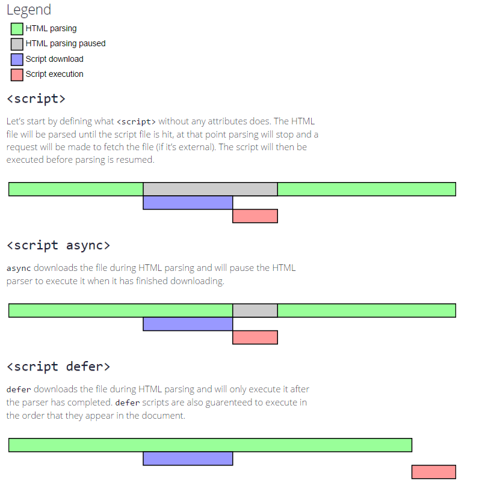

# script属性 async & defer

最近在回顾红宝书，书中介绍了 `script` 元素，中有2个属性`async`和`defer`。

- async：表示应该立即下载脚本，但不应该妨碍页面的其他操作，比如下载其他资源或等待加载其他脚本。只对外部脚本有效。
- defer：表示脚本可延迟到文档完全被解析和显示之后在执行。只对外部脚本有效。

### async

有以下代码片段例如：

```html
<script src="a.js" async></script>
<script src="b.js" async></script>
```

`a.js`和`b.js`会异步的和页面其他资源一起下载，然后执行`a`和`b`。

如果页面中嵌入有`script`标签内容会优先被执行。例如：

```html
<script>console.log("async before")</script>
<script src="a.js" async></script>
<script src="b.js" async></script>
<script>console.log("async after")</script>
```

实际的结果会先打印出`before`和`after`然后运行`a`和`b`。

如果页面嵌入一个普通的`script`外部引用。例如：

```html
<script src="before.js"></script>
<script src="a.js" async></script>
<script src="b.js" async></script>
<script src="after.js"></script>
```

实际的结果会先打印出`before`和`after`然后运行`a`和`b`。

```html
<script src="a.js" async></script>
<script src="b.js" async></script>
<script src="before.js"></script>
<script src="after.js"></script>
```

实际的结果会先打印出`a`然后运行`before`和`after`最后是`b`。

如果我们加入 `DOMContentLoaded` 事件会如何，例如：

```html
<script src="a.js" async></script>
<script src="b.js" async></script>
<script>
document.addEventListener('DOMContentLoaded',function(){
    console.log('DOMContentLoaded');
});
</script>
```

`DOMContentLoaded`会优先于`a`和`b`执行。

```html
<script src="a.js" async></script>
<script src="b.js" async></script>
<script src="main.js"></script>
```

效果会先执行`a`在运行`DOMContentLoaded`最后是`b`。和之前脚本都在`async`之后效果相同。


::: tip 小结
- `async`立即下载，但不应该妨碍页面的其他操作。
- 当脚本下载完后立即执行。（两者执行顺序不确定，执行阶段不确定，可能在 `DOMContentLoaded` 事件前或者后）
:::

### defer

直接上代码：

```html
<script>console.log("code 1")</script>
<script src="before.js"></script>
<script src="a.js" defer></script>
<script>console.log("code 2")</script>
<script src="b.js" defer></script>
<script src="after.js"></script>
<script>console.log("code 3")</script>
<body>
<script>console.log("code 4")</script>
</body>
```

效果是`defer`属性的脚本会在其他脚本(外部脚本)之后执行，这很符合标准中的描述（脚本可延迟到文档完全被解析和显示之后在执行）

```html
<script>
document.addEventListener('DOMContentLoaded',function(){
    console.log('DOMContentLoaded');
});
</script>
<script src="a.js" defer></script>
<script src="b.js" defer></script>
<body>
</body>
```
效果是`defer`属性的脚本会在 `DOMContentLoaded`事件之前执行。`a`和`b`按先后次序依次执行。

::: tip 小结
- `defer`延迟到文档完全被解析和显示之后在执行。
- 脚本会在`DOMContentLoaded`前依次执行。
:::

最后来看一张图，这张图描述了`async`和`defer`的差异。



原文[地址](https://www.growingwiththeweb.com/2014/02/async-vs-defer-attributes.html)


